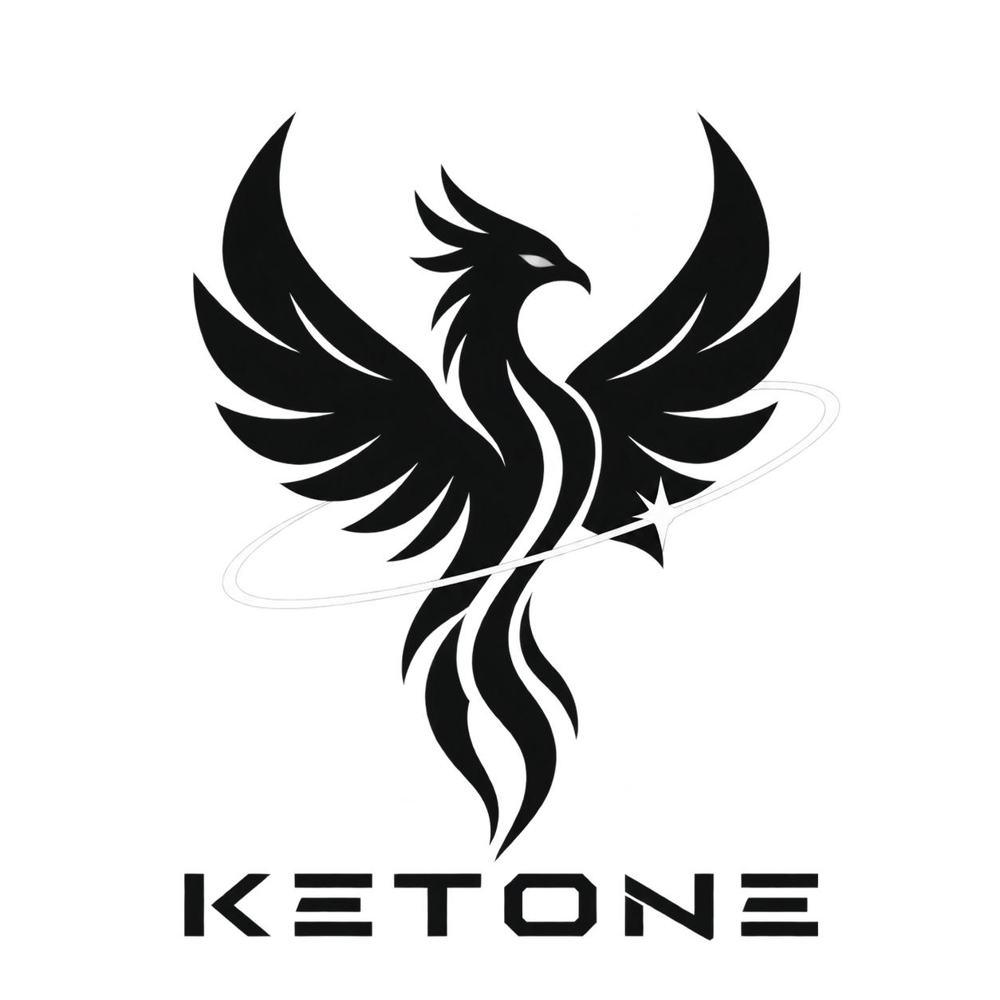

<p align="left">
    
</p>

# Ketone
> A hobby x86_64 operating system built from scratch.

Ketone is a small operating system written from the ground up.

## Why?
Because I can.

## Building
Make sure you have the following things installed:
* nasm
* gcc
* make
* qemu
* exfatprogs

Run the following to build
```bash
    make -j2 all
```
Thats it !

## Running
### Requirements
* SSE2
* x86_64
* 4 GiB RAM

The easiest way to experiment with Ketone is through an emulator such as QEMU via the makefile.
```bash
    make run
```

Running on real hardware is **not recommended yet** unless you know exactly what you're doing. Ketone is an experimental kernel and may contain bugs capable of making hardware very unhappy.

QEMU is your friend.

## Roadmap
Planned areas include:
* 🟩 64-bit boot
* 🟩 Basic paging
* 🟩 Kernel memory management
* 🟩 ATA PIO driver
* 🟩 Initial exFAT support
* 🟨 More complete exFAT support
* 🟨 ACPI
* 🟥 PCI and PCIe
* 🟥 SATA
* 🟥 Interrupt handling

### Key
* 🟩 done
* 🟨 doing
* 🟥 to-do

This roadmap is intentionally subject to change because operating systems have a funny habit of turning a one-day task into a three-week side quest.

## Disclaimer

Ketone is experimental software(duh).

It is not intended to replace a production operating system and should not be trusted with important data.

Use it in an emulator or on hardware you are prepared to recover.

## License

Ketone is licensed under the MIT License.

See [`LICENSE`](licence.txt) for the full license text.
